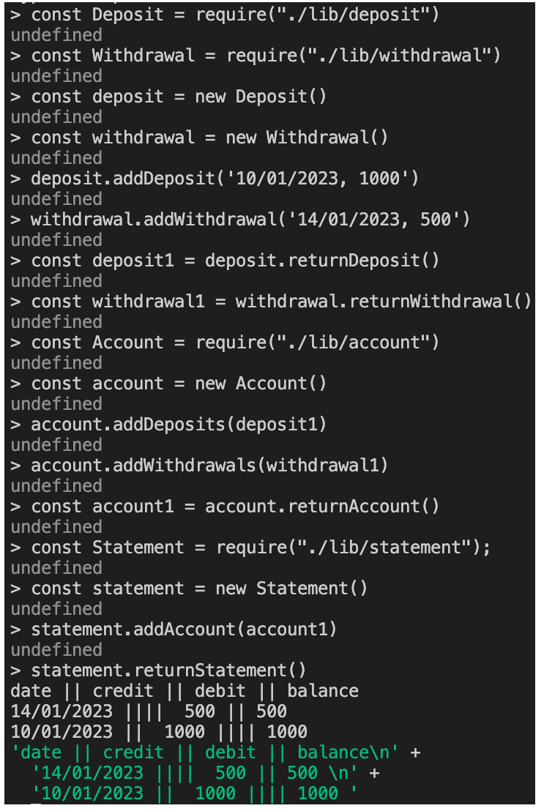
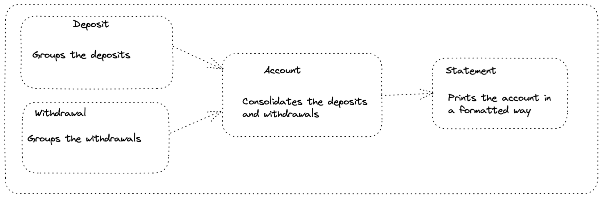

# Bank tech test
***
## Specification

### Requirements

* You should be able to interact with your code via a REPL like IRB or Node.  (You don't need to implement a command line interface that takes input from STDIN.)
* Deposits, withdrawal.
* Account statement (date, amount, balance) printing.
* Data can be kept in memory (it doesn't need to be stored to a database or anything).

### Acceptance criteria

**Given** a client makes a deposit of 1000 on 10-01-2023
**And** a deposit of 2000 on 13-01-2023
**And** a withdrawal of 500 on 14-01-2023
**When** she prints her bank statement
**Then** she would see

```
date || credit || debit || balance
14/01/2023 || || 500.00 || 2500.00
13/01/2023 || 2000.00 || || 3000.00
10/01/2023 || 1000.00 || || 1000.00
```
***
### Quick Start

### Set up

1. Clone this repo.

2. Install dependencies with:
```shell
npm install
```
```shell
npm add jest
```

Run tests with:
```shell
jest
```
***
### How to make a deposit / withdrawal:
1. Require deposit / withdrawal with:
```js
const Deposit = require("./lib/deposit")
```
```js
const Withdrawal = require("./lib/withdrawal")
```

2. Set up a new deposit / withdrawal:
```js
const deposit = new Deposit()
```
```js
const withdrawal = new Withdrawal()
```
3. Add the  amount and the date it was deposited/ withdrawn:
```js
deposit.addDeposit('10/01/2023, 1000')
```
```js
withdrawal.addWithdrawal('14/01/2023, 500')
```
4. Return the deposit / withdrawal:
```
const deposit1 = deposit.returnDeposit()
```
```js
const withdrawal1 = withdrawal.returnWithdrawal()
```
5. Require account with:
```js
const Account = require("./lib/account")
```
6. Set up a new account:
```js
const account = new Account()
```
7. Add the deposit / withdrawal to the account:
```js
account.addDeposits(deposit1)
```
```js
account.addWithdrawals(withdrawal1)
```
8. Return the account:
```js
const account1 = account.returnAccount()
```
9. Require statement with:
```js
const Statement = require("./lib/statement");
```
10. Set up a new statement:
```js
const statement = new Statement()
```
11. Add the account to the statement
```js
statement.addAccount(account1)
```
12. Print the statement:
```js
statement.returnStatement()
```
***
### Preview
What to expect when you run in node


***
### Planning
Overview of the each class at the highest level



***
### Edge cases to consider / improvements
- empty string added to deposit / withdrawal
- withdrawal larger than balanace
- date entered but no deposit / withdrawal
- date not entered with deposit / withdrawal
- decimals are hard coded - need to be part of  balance so they can be changed
***
